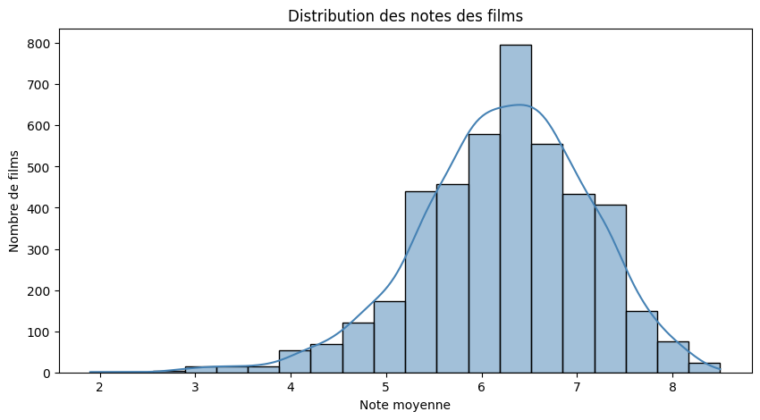
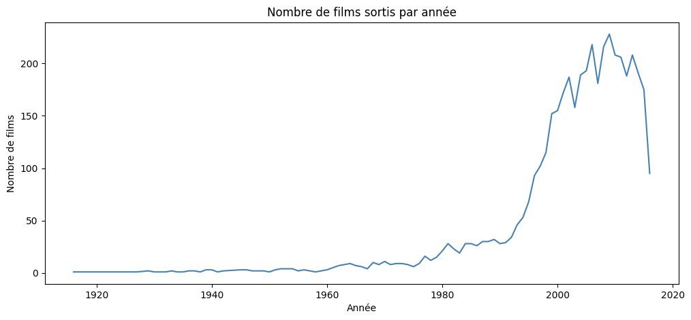
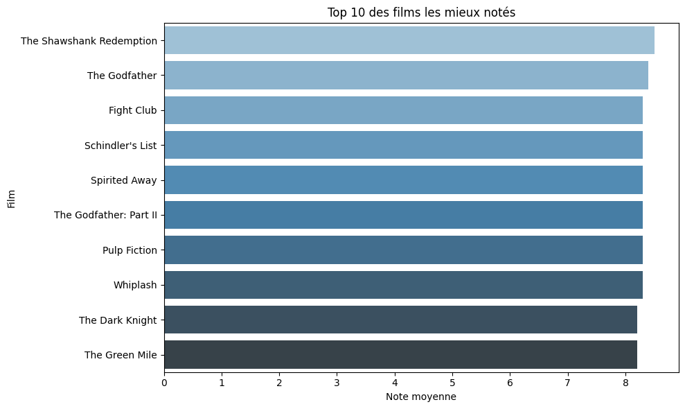

# 🎬 Analyse des films TMDB

## Contexte
Projet d'analyse exploratoire (EDA) réalisé sur le dataset TMDB 5000 Movies.
L'objectif est d'identifier des tendances utiles pour une plateforme de streaming :
quels films mettre en avant ? La production cinématographique augmente-t-elle avec le temps ?

---

## Dataset
- **Source** : [Kaggle - TMDB Movie Metadata](https://www.kaggle.com/datasets/tmdb/tmdb-movie-metadata)
- **Taille initiale** : 4803 films, 20 colonnes
- **Taille après nettoyage** : 4386 films

Le dataset original contient deux fichiers : `tmdb_5000_movies.csv` et
`tmdb_5000_credits.csv`. Seul le premier a été utilisé dans cette analyse,
car il contient toutes les informations nécessaires (notes, genres, dates de sortie).
`tmdb_5000_credits.csv` contient les informations sur les acteurs et réalisateurs,
ce qui pourrait faire l'objet d'une analyse future.

---

## Outils utilisés
- **Python** : langage principal
- **Pandas** : manipulation et nettoyage des données
- **Matplotlib / Seaborn** : visualisations graphiques
- **ast** : conversion des colonnes JSON en vraies listes Python

---

## Choix techniques

### Pourquoi ast.literal_eval() ?
En affichant les premières lignes avec `head()`, on a remarqué que les colonnes
`genres`, `keywords`, `production_companies` contenaient des listes de dictionnaires
écrites en texte brut. Pandas ne pouvait pas les manipuler directement.
`ast.literal_eval()` transforme ce texte en vraies structures Python,
ce qui permet d'extraire par exemple les noms des genres.

### Pourquoi avoir filtré les films avec vote_count < 10 ?
Un film avec seulement 2 votes à 10/10 n'est pas statistiquement fiable.
On a gardé uniquement les films avec au moins 10 votes
pour avoir des résultats représentatifs.

### Pourquoi vote_count >= 100 pour le Top 10 ?
Pour le classement des meilleurs films, on a appliqué un seuil plus strict
afin d'éviter qu'un film confidentiel avec très peu de votes
domine le classement injustement.

### Pourquoi supprimer les films avec runtime = 0 et vote_average = 0 ?
Ces valeurs à 0 ne représentent pas de vrais films mais des données manquantes.
Les garder aurait faussé les moyennes et les visualisations.

---
## Analyses réalisées

### 1. Distribution des notes
Histogramme de la colonne `vote_average` pour comprendre
la qualité générale du catalogue.



### 2. Évolution des sorties par année
Courbe du nombre de films sortis par année pour observer
la croissance de la production cinématographique.



### 3. Top 10 des films les mieux notés
Classement des 10 films avec la meilleure note moyenne
parmi les films ayant au moins 100 votes.



---

## Conclusions
- La majorité des films ont une note entre **5.5 et 7**
- La production cinématographique a **explosé à partir des années 1990**
- **The Shawshank Redemption** est le film le mieux noté du dataset avec ~8.5/10
- Les données manquantes (budget, revenue à 0) montrent les limites du dataset :
  une analyse financière nécessiterait un nettoyage supplémentaire

---

## Structure du projet

```
analyse_films_tmdb.ipynb   -> Notebook principal
tmdb_5000_movies.csv       -> Dataset utilisé pour l'analyse
tmdb_5000_credits.csv      -> Fichier présent dans le dataset original (non utilisé dans cette analyse)
README.md                  -> Documentation
```

---

## Auteure
Projet personnel réalisé dans le cadre de mon apprentissage de la Data Analyse.
